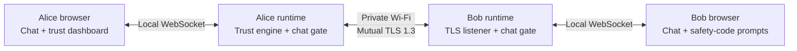

# TrustWeave

Adaptive-trust encrypted chat for private networks. An experimental application that uses connection metadata to decide when users should verify each other's identity again.

Built as a Computer Network Technology project, TrustWeave combines **mutual TLS 1.3**, **adaptive trust scoring**, and **two-person safety-code verification**. It is designed for two Windows laptops on the same private Wi-Fi network.

## Overview

The two laptops are called **Alice** and **Bob**:

| Alice | Bob |
|---|---|
| Connects to Bob's laptop | Starts the chat server |
| Has a chat interface and live trust dashboard | Has a simple chat interface |
| Can introduce controlled demo conditions | Responds to safety-code prompts |

Both users compare independently calculated safety codes before chat becomes available. If connection behavior triggers another verification, messaging pauses. Successful reverification establishes a fresh TLS session; a mismatch, cancellation, or timeout closes the session.

**Project status:** The latest suite has **181 passing tests**. Basic two-laptop chat success is user-reported; full physical recovery and rejection acceptance remains unconfirmed. This is an academic prototype, not a production messaging service.

## Features

- **Authenticated encrypted messaging:** mutual TLS 1.3 with certificate validation, hostname verification, and peer identity pinning.
- **Dual verification:** both users must approve the same safety-code comparison before messaging is enabled.
- **Adaptive trust:** connection measurements feed weighted exponential moving average (EMA) scoring and sudden-drop detection.
- **Live observability:** Alice sees trust, round-trip time (RTT), normalized signals, session details, and a metadata-only audit timeline.
- **Controlled demonstrations:** real induced latency, bounded TLS reconnects, and explicitly labeled IP-metadata simulation.
- **In-memory conversation:** recent messages survive browser refresh and successful TLS recovery; application exit clears the conversation.

## Quick start: two Windows laptops

### Requirements

- Two Windows laptops on the same private Wi-Fi network.
- Python 3.14 with OpenSSL 3.0 or newer and TLS 1.3 support.
- Internet access for the initial dependency installation.
- A USB drive for transferring the appropriate identity bundle.

### 1. Install on both laptops

Download or clone this repository onto each laptop. In each project folder, double-click:

```text
setup-demo.cmd
```

This creates a local Python environment and installs the pinned dependencies. Do not copy a `.venv` folder from one laptop to the other.

### 2. Create the identities once

On one trusted laptop, double-click:

```text
provision-demo.cmd
```

Enter three different passwords for the organizer, Alice, and Bob. Use at least 16 characters with eight distinct characters in each password. Keep these passwords available for the appropriate participant.

The command creates:

```text
demo-identities/
|-- organizer/      # Keep on the trusted provisioning laptop
|-- alice-bundle/   # Alice's credentials
`-- bob-bundle/     # Bob's credentials
```

Place `alice-bundle` inside `demo-identities` on Alice's laptop and `bob-bundle` inside `demo-identities` on Bob's laptop, using trusted USB transfer as needed. Transfer only the matching device bundle. Keep the organizer's CA private key on the trusted laptop, and communicate passwords separately.

### 3. Start Bob, then Alice

| Laptop | Open | In the browser |
|---|---|---|
| Bob | `start-bob.cmd` | Unlock the identity, click **Start server**, and note the private IPv4 address |
| Alice | `start-alice.cmd` | Unlock the identity, enter Bob's IPv4 address, and click **Connect to Bob** |

If Windows Firewall prompts, allow Python on **Private networks only**. The application does not modify firewall settings automatically.

### 4. Compare and chat

Compare the **entire safety code** on both screens. If the codes match, select **MATCH on both laptops** within the comparison window. Sending remains disabled until both users approve.

You can now exchange messages. To exit, press **Ctrl+C** in each launcher window; closing the browser alone does not stop the local service.

For detailed instructions or connection problems, see the [setup and troubleshooting guide](docs/two-device-operation.md).

## How it works



Both browser services bind to `127.0.0.1:8766`. Only Bob's TLS listener, on port `8765`, accepts LAN connections. Alice connects to Bob's numeric IP while authenticating the TLS hostname `bob.local`.

The trust engine observes handshake latency, heartbeat RTT and variation, timing, peer IP, and recent session establishments. It does not inspect message contents to calculate trust. Heartbeats continue while users are not typing.

See [architecture and security boundaries](docs/two-device-architecture.md) for implementation details.

## Demonstration controls

These controls appear on Alice's dashboard:

| Control | What changes | Display label |
|---|---|---|
| Induce latency | Bob intentionally delays chat/pong handling | `REAL INDUCED CONDITION` |
| Reconnect burst | Up to three fresh authenticated TLS connections | `REAL CONNECTION EVENT` |
| Simulate IP continuity change | Only the trust input changes; the physical IP stays the same | `SIMULATED METADATA` |
| Restore normal | Removes the active condition | `NORMAL OBSERVATION` |

Only one condition runs at a time. Verification depends on the measured trust score and its change; every control does not necessarily produce an immediate prompt. Use the [presenter script](docs/two-device-presentation.md) for a complete walkthrough.

## Development and testing

From the repository folder in PowerShell:

```powershell
py -3.14 -m venv .venv314
.\.venv314\Scripts\python.exe -m pip install -r requirements.txt
.\.venv314\Scripts\python.exe -m pytest -q
.\.venv314\Scripts\python.exe -m client.final_demo
.\.venv314\Scripts\python.exe -m pip check
```

Tests cover protocol validation, TLS authentication, chat gating, dual verification, bidirectional messages, recovery, induced conditions, browser-origin checks, and payload leakage into logs or storage. Local acceptance tests use real TLS with automated verification decisions; they do not replace physical two-person testing.

The revalidated environment is **Windows, Python 3.14.7, and OpenSSL 3.5.7**, with **181 tests passing**. OpenSSL 3.0+ with TLS 1.3 is accepted; the minimum-version check is unit-tested, while full-suite evidence uses 3.5.7. The setup and launch scripts use `.venv314`; an existing `.venv` is preserved. Run setup on each laptop after upgrading Python. Exact dependencies are in [requirements.txt](requirements.txt), and results are recorded in [BUILD_STATUS.md](BUILD_STATUS.md).

## Additional demos

The repository also preserves the original single-machine dashboard and deterministic experiments. They are optional and are not needed to run the two-device chat.

```powershell
# Original local dashboard
.\.venv314\Scripts\python.exe -m dashboard.app

# Deterministic experiments
.\.venv314\Scripts\python.exe -m experiments.sudden
.\.venv314\Scripts\python.exe -m experiments.evaluation
```

The original dashboard uses explicitly simulated verification. It shares UI port `8766` with chat, so stop one before launching the other on the same laptop. Read the [experiment documentation](docs/experiments.md) for more information.

## Security and scope

- Chat text is limited to **4 KiB of UTF-8 data** per message; empty messages are rejected. The default conversation limit is 500 recent messages.
- Message bodies, passwords, private keys, and TLS secrets are not written to application telemetry or audit storage. SQLite retains connection and trust metadata.
- Encrypted credential bundles depend on trusted provisioning and transfer. The prototype does not provide production certificate renewal or revocation.
- Local users, endpoint software, and the operating system are trusted. Python cannot guarantee complete secret-memory erasure.
- A high trust score is not proof that a connection is attack-free. Controlled anomalies demonstrate system behavior, not real-world attack-detection accuracy.
- Trust weights remain heuristic. A small [measured calibration pilot](docs/measured-calibration.md) compares settings using real TLS timing and separate held-out sessions; it does not validate attack detection.
- Internet relays, accounts, group chat, attachments, and permanent message history are outside the project scope.

## Documentation

| Guide | Purpose |
|---|---|
| [Setup and troubleshooting](docs/two-device-operation.md) | Installation, bundle transfer, startup, and recovery |
| [Architecture](docs/two-device-architecture.md) | Network boundaries, components, verification, and security limits |
| [Presenter script](docs/two-device-presentation.md) | Guided demonstration and explanation of each control |
| [Physical acceptance checklist](docs/two-device-acceptance.md) | Two complete test runs on separate laptops |
| [Trust algorithms](docs/algorithms.md) | Normalization, EMA scoring, and trigger policy |
| [Build status](BUILD_STATUS.md) | Implementation checkpoints and recorded test evidence |
