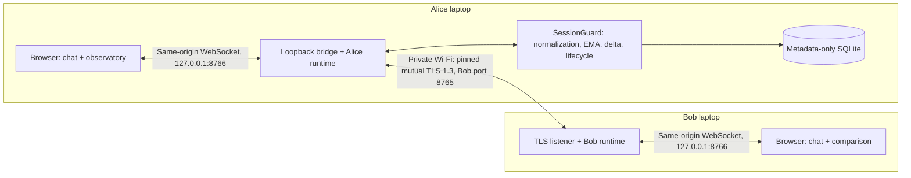

# Two-device chat architecture

The chat application uses the existing mutual TLS transport and adaptive-trust engine.
It adds independent endpoint runtimes, a strict application protocol, a chat-specific
gate, dual human comparison, and loopback browser bridges. The legacy echo demos and
simulated dashboard remain available separately.

Alice routes to Bob's numeric private IPv4 while authenticating the hostname
`bob.local`. Certificate validation, hostname validation, SPKI pinning, and fresh
TLS 1.3 are required. TLS terminates in the Python endpoint processes; browsers use
local loopback connections. Neither browser service is a LAN server.

## Components and ownership

| Component | Responsibility |
|---|---|
| `chat/bundles.py` | Trusted provisioning, signed manifests, role/integrity inspection |
| `chat/protocol.py` | Version-one UTF-8 JSON envelopes, strict fields, bounded ID cache |
| `chat/coordinator.py` | State transitions, bidirectional chat gate, queue invalidation |
| `chat/verification.py` | Locally derived code and request/relationship-bound decisions |
| `chat/runtime.py` | Bob listener, shared in-memory conversation, acknowledgments, controls |
| `chat/alice.py` | Alice trust, heartbeat measurements, anomaly controls and TLS recovery |
| `chat/bridge.py` | Loopback/host/origin checks and bounded WebSocket command/event queues |
| `chat/app.py` | Preflight, local service startup, browser opening and cleanup |

Alice owns trust decisions. Bob mirrors authenticated lifecycle controls and enforces
his own chat gate. Bob never receives Alice's score, raw trust snapshot, or audit
timeline. System controls remain available while chat is gated. Restriction is
terminal for the current session; retry requires an explicit new session.

## Verification and recovery

1. On every new application connection, both gates enter VERIFYING, including when
   the relationship was successfully verified in an earlier run.
2. Each endpoint derives the entire grouped code from its authenticated symmetric
   relationship ID. No peer-supplied display code is used as local truth.
3. Each human selects MATCH, MISMATCH, or CANCEL. Both MATCH decisions must correlate
   to the same request and relationship within the default 30-second window.
4. Initial success applies the verified trust floor and activates chat on the
   existing authenticated connection. Reverification success authorizes a fresh
   TLS connection. Mismatch, cancellation, timeout, stale/conflicting decisions,
   or loss of the comparison surface restricts the session.
5. For recovery, Bob reserves a bounded window. Alice closes the old connection,
   performs a fresh pinned handshake, checks relationship continuity, and correlates
   the approval on the replacement channel. A readiness exchange precedes resumed
   chat. The public session/key-epoch identifier changes; it is not a secret key.

Scheduled chat key rotation also requires dual comparison. The authenticated,
user-requested reconnect-burst demonstration performs at most three real reconnects
of an already verified relationship; it does not silently approve a human prompt.

## Data and measurement boundaries

- Chat text is limited to 4096 UTF-8 bytes. Empty/whitespace-only text is rejected.
  Text is held in bounded process/browser memory (500 recent messages by default),
  survives refresh and verified recovery, and is cleared on application exit.
- Message text is confined to conversation state and chat browser events. Trust
  snapshots, SQLite audit/history, application logs and experiment results contain
  metadata only. The complete browser state necessarily includes its conversation;
  it must not be treated as an exportable telemetry artifact.
- Handshake latency, RTT/variation, frame timing, peer IP and establishment events
  come from authenticated transport observations. Trust timing uses actual heartbeat
  completion cadence, so the absence of human typing is not itself anomalous.
- IP-continuity simulation overrides only Alice's trust input. The physical peer IP
  and TLS authentication stay unchanged. Induced latency and reconnect bursts cause
  genuine measurements/events and carry distinct labels.

Default bounds include 128 queued events/messages, 2048 remembered IDs, four local
browser clients, four concurrent Bob handshake/handler tasks, one admitted chat
peer, and at most three recovery attempts. Bounded replay caches do not provide
indefinite historical replay memory. Trust does not replace TLS authentication.

## Security limits and remaining validation

Signed manifests detect partial bundle tampering. Trusted provisioning/USB transfer
anchors identity: replacing an entire bundle and its CA cannot be detected without
an external trusted fingerprint. Endpoint keys and the CA key are encrypted on disk;
passwords are not persisted, but Python cannot guarantee memory zeroization or
prevent OS paging/crash dumps.

Local users/processes and endpoint software are trusted. There is no account system,
production revocation/renewal service, tamper-evident audit, database encryption, or
internet relay. SQLite retains identifying metadata. A high trust score is not proof
that no attack exists, and induced-condition tests are not attack-detection accuracy.

The recorded environment is Windows/Python 3.10.11/OpenSSL 1.1.1t. Preserve the exact
environment as test evidence; any runtime upgrade requires revalidation. Automated
local checks passed, while two physical Wi-Fi runs, USB transfer and actual two-person
browser comparison remain on the [acceptance sheet](two-device-acceptance.md).
